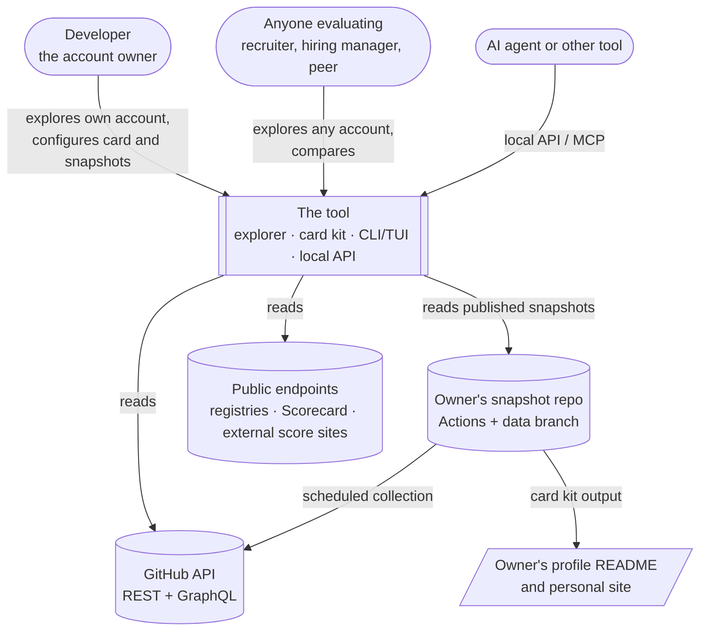
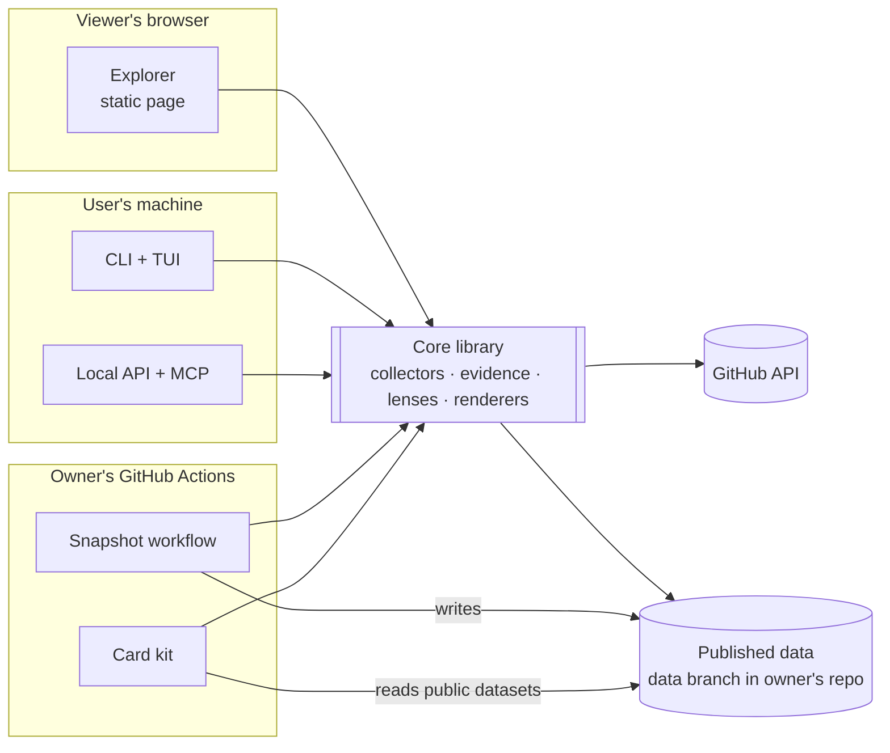
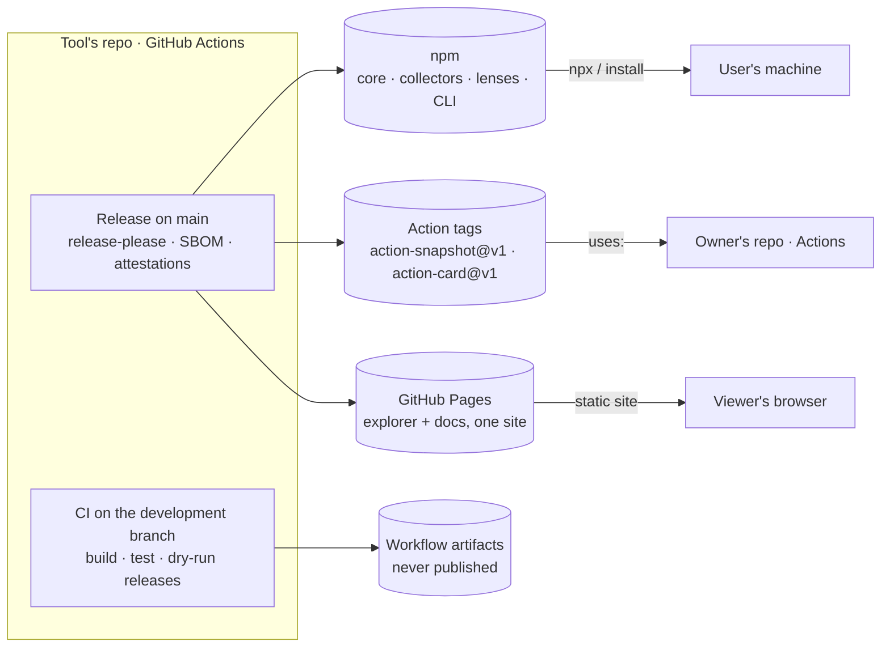

# Architecture

Status: draft, 2026-10-09. Decisions are linked to their ADRs; everything else is marked `[Proposed — unconfirmed]`.

## Principles

Borrowed from Neovim's project principles ([ADR-0012](adr/0012-neovim-principles.md)):

1. **Work as a component.** Embedding is a primary use case. The core is a library that does analysis without assuming where it runs or how data is fetched.
2. **Work as a platform.** Users can extend the core without limits: collectors, lenses, visuals, external scores. Custom judgments are always labelled with the lens that produced them.
3. **Work as a server.** Two things fill this role, with no hosted server: a **local headless mode** (the CLI exposes the analysis over a local API and MCP for other UIs and agents), and the **snapshot workflow** (the long-running, stateful part, scheduled by GitHub Actions in the user's own repo).
4. **Work in the terminal.** The TUI should feel like any modern GUI, not a text dump.

## System context

No component of the tool runs on infrastructure the project owns. Work happens in the viewer's browser, the user's terminal, or the account owner's GitHub Actions ([ADR-0003](adr/0003-no-database-no-hosted-server.md)).

## Containers

| Container | Runs in | Job |
| --- | --- | --- |
| Core library | Anywhere (browser, Node, Actions) | Collect evidence, compute dimensions, apply lenses, render |
| Explorer | Viewer's browser, served as a static site | Today, Long term and Compare views |
| CLI + TUI | User's machine (Node) | Same analysis in the terminal |
| Local API + MCP | User's machine (Node) | Headless access for other UIs and agents |
| Snapshot workflow | Owner's GitHub Actions | Append snapshots; publish opt-in datasets |
| Card kit | Owner's GitHub Actions | Render images, README fragment and HTML from public datasets |

## Deployment `[Proposed — unconfirmed]`

Where each piece is built, where it's published, and where it runs. Design: [RFC-0003](rfc/0003-build-release-delivery.md).

| Artifact | Built and published by | Published to | Runs in |
| --- | --- | --- | --- |
| Libraries (`schema`, `core`, collectors, `lenses`, `render`) | Release workflow on `main` | npm, with provenance | Wherever they're embedded |
| CLI (TUI, local API, MCP) | Release workflow on `main` | npm | User's machine |
| Snapshot and card Actions | Release workflow on `main` | Version tags in the repo (bundled JavaScript) | Owner's GitHub Actions |
| Explorer and user docs | Release workflow on `main` | GitHub Pages, one site | Viewer's browser |
| Published data | Owner's snapshot workflow | Data branch in the owner's repo | Read by any tool |

The development branch builds all of these and uploads them as workflow artifacts; it publishes none of them.

## Data flow

1. **Resolve** the subject: an account (user or org) or a repo, plus what the credential can see.
2. **Plan** which collectors run and what they'll cost against the rate budget.
3. **Collect** evidence from GitHub, published snapshots and public endpoints. Every record carries its source, time and access level ([RFC-0001](rfc/0001-evidence-metrics-lenses.md)).
4. **Derive** metrics and dimensions from evidence.
5. **Apply a lens**: select, normalize and arrange.
6. **Render** for the surface: explorer views, TUI panes, card images, API responses.

Steps 4–6 need only evidence, so anything collected once can be re-analysed under another lens without touching GitHub again.

## Package layout `[Proposed — unconfirmed]`

| Package | Role |
| --- | --- |
| `schema` | Evidence, lens and publication schemas; generated TypeScript types |
| `core` | Planner, metric derivation, dimensions, lens engine, plugin host |
| `collector-github` | GitHub REST and GraphQL collectors |
| `collector-snapshots` | Reads published snapshot data and the legacy `traffic-log` / `starlines` formats |
| `collector-public` | Registries, Scorecard, external score sites |
| `lenses` | Built-in lenses |
| `render` | Shared chart and card rendering (SVG) |
| `explorer` | The static web app |
| `cli` | CLI, TUI, local API, MCP |
| `action-snapshot` | Snapshot workflow Action |
| `action-card` | Card kit Action |

## Stack `[Proposed — unconfirmed]`

TypeScript with a build step that outputs a static site is decided ([ADR-0002](adr/0002-typescript-with-static-build.md)). The tool choices below are suggestions.

| Concern | Suggestion | Why |
| --- | --- | --- |
| Language | TypeScript, strict, ESM only | Decided; one language across browser, CLI and Actions |
| Workspace | pnpm workspaces | Monorepo without heavy tooling |
| Explorer build | Vite | Static output for GitHub Pages; fast dev loop |
| GitHub client | Octokit (REST, GraphQL, throttling, retry) | GitHub's own SDK; rate-limit aware |
| Schemas | Zod as source, exported to JSON Schema | One definition for types, validation and published schemas |
| Charts | Carry Smokey's hand-built SVG approach forward, in shared `render` code | The same chart must render in the browser, the TUI's image fallbacks and the card kit |
| TUI | Ink | Mature React model for terminals; worth a spike against newer libraries |
| Local API | Hono on Node | Small, standard request handling |
| MCP | Official TypeScript SDK | Agents call the same analysis |
| Tests | Vitest with recorded API fixtures; Playwright for the explorer (as Smokey does now) | Catches GitHub API drift; keeps Smokey's end-to-end discipline |

## Rate budget and caching `[Proposed — unconfirmed]`

- Every collector declares its API cost; the planner fits work to the budget available: 60 requests/hour unauthenticated, 5,000 with a token.
- Conditional requests (ETag / Last-Modified) everywhere, as Smokey's feed and notifications already do.
- GraphQL for per-account and per-repo questions that would otherwise fan out over many REST calls.
- Browser cache in `localStorage`/IndexedDB; disk cache for the CLI. Both are the viewer's own copies, with time-to-live per signal type.
- Comparisons without a token degrade to the cheapest signals and say so on screen.

## Constraints carried from Smokey

- The token is stored only in the browser and sent only to `api.github.com` (see [threat-model.md](threat-model.md)).
- Match repos by canonical `full_name`, never by user-typed strings (Smokey's repo-rename lesson).
- Never advance a sync cursor after a partial fetch (Smokey's issue-sync lesson).
