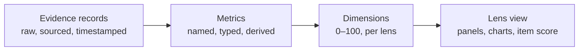

# RFC-0001: Evidence, metrics, dimensions and lenses

- Status: Draft, 2026-10-09
- Covers: how data is recorded, derived, judged and shown

Everything in this RFC is `[Proposed — unconfirmed]` except where it cites an ADR. The ADRs record what's decided; this RFC proposes how to build it.

## Goals

- One data model for every surface: explorer, TUI, card kit, local API, published snapshots.
- Any evidence collected once can be re-judged under another lens without refetching.
- Results are explainable: every value on screen traces back to evidence records.
- Lenses carry all judgment ([ADR-0007](../adr/0007-lenses-not-categories.md)); the core doesn't encode opinions.

## Four layers

### 1. Evidence records

The atomic unit. One record is one observed fact about one subject at one time. Schema: [evidence-record.schema.json](../schemas/evidence-record.schema.json).

| Field | Meaning |
| --- | --- |
| `subject` | `{ type: "user" \| "org" \| "repo", login or fullName, nodeId }`. `nodeId` is GitHub's stable ID, so renames can't silently drop data (Smokey's repo-rename lesson). |
| `metric` | Namespaced key, for example `github.repo.release.downloads` |
| `value` | Number, string, boolean or small object |
| `at` or `period` | A point in time, or a `{ start, end }` window (traffic days, contribution years) |
| `source` | Collector ID and version, plus the endpoint |
| `access` | `public`, `token`, `owner` or `snapshot`: what was needed to see it |
| `provenance` | `api`, `snapshot`, `derived` or `external`, plus an attestation reference when signed |

Records are append-only. A later observation of the same `(subject, metric, period)` replaces the earlier one, as Smokey's traffic logger already does for overlapping days.

### 2. Metrics

A registry describes every metric key: title, unit, applicable subject types, whether higher is better, how it aggregates over time (sum, last, median), API cost, and whether it's **controllable** or **context** ([ADR-0008](../adr/0008-controllable-vs-context.md)). Collectors register the metrics they produce. Derived metrics (for example "median first maintainer response, last 180 days") are computed from records and carry `provenance: derived` plus references to their inputs.

The catalog of known metrics: [metrics-catalog.md](../metrics-catalog.md).

### 3. Dimensions

A dimension maps one or more metrics to 0–100 for display ([ADR-0006](../adr/0006-no-headline-score-for-people.md)). Lenses define dimensions; the core supplies normalizers:

| Normalizer | Use | Example |
| --- | --- | --- |
| `threshold` | Piecewise-linear between a zero point and a full point | Response ≤ 72 h → 100, ≥ 14 days → 0 |
| `log` | Quantities spanning orders of magnitude | Downloads per week |
| `relative` | Within a comparison, scaled to the larger of the subjects | Two accounts' release cadence side by side |
| `formula` | Reproducing an external formula exactly | github-readme-stats rank |

**Unknown is not zero.** A metric that couldn't be measured (no token, API gap, rate limit) leaves its dimension unknown, drawn as such. Each view reports **coverage**: the share of its dimensions actually measured.

### 4. Lens views

A lens ([lens.schema.json](../schemas/lens.schema.json)) declares:

- identity: `id`, `version`, `title`, `description`, applicable subject types;
- dimensions, each with its metrics and normalizer;
- panels: what to draw and in what order (trend line, small multiples, radar or bar profile, adoption timeline, today list, table);
- optionally an **item score** for repos and orgs, as weights over dimensions. Never for users.

Every rendered result carries the lens `id@version` ([ADR-0013](../adr/0013-labelled-judgments.md)).

## Starting lenses

Candidates for the built-in set; the real set is an open question.

| Lens | For | Shows |
| --- | --- | --- |
| Today | Me, maintaining | Smokey's current views: attention, CI, feed, charts |
| Maintainer habits | Me improving; evaluators | Response times, issue resolution, release cadence and notes, CI health, docs kept current |
| Reach | Context for anyone | Downloads, stars over time, watchers, dependents, traffic (owner/snapshot) |
| Practice adoption | Repo modelling | Timeline of when CI, releases, changelog, templates, security policy, dependency automation first appeared |
| Sponsors view | Head-to-head comparisons | Sponsors listing details where public, plus maintainer habits and reach |
| github-readme-stats | External-score goal | The same inputs and formula as github-readme-stats, with what moves the rank |

## Comparison semantics

- **Same lens on both sides.** Comparing under two different lenses isn't allowed.
- **Shared scales per panel.** `relative` normalizers use the larger subject as the top of the scale.
- **Account aggregation.** An account's repo-level metrics roll up over a repo set: owned non-fork repos by default, or a set the viewer picks. The set is shown, since it changes the result.
- **Time alignment.** Calendar alignment by default. Age alignment ("month N since first commit") for repo modelling, so a three-year-old project can be compared with the first three years of an older one.

## Practice-adoption timeline

For repo modelling: when did each practice first appear? Derive it from the first commit touching a path (`.github/workflows/`, `CHANGELOG.md`, `SECURITY.md`, `.github/ISSUE_TEMPLATE/`, `.github/dependabot.yml`, Renovate config) and from the first release. Commit history filtered by path is available through GraphQL; cost is roughly one query per practice per repo, so this belongs to a deliberate "deep" fetch, not the default.

## External scores

An external-score plugin is a collector plus, optionally, a lens:

- **Tracked:** read the site's public value; snapshots build its history ([ADR-0014](../adr/0014-external-scores-as-plugins.md)).
- **Reproduced:** implement the published formula as a `formula` normalizer over GitHub metrics, so the lens can show which inputs move it. github-readme-stats is the reference: its rank uses commits, PRs, issues, reviews, stars and followers.

## Open questions

- Which lenses ship first, and who writes their thresholds.
- Percentile normalization against a reference population would need data from outside the user's own account. Is a static, versioned reference table acceptable under the no-database rule, or is percentile normalization out?
- How the explorer lets a viewer edit a lens: change thresholds only, or compose new panels.
- Repo-set defaults for org accounts with hundreds of repos, within rate limits.
